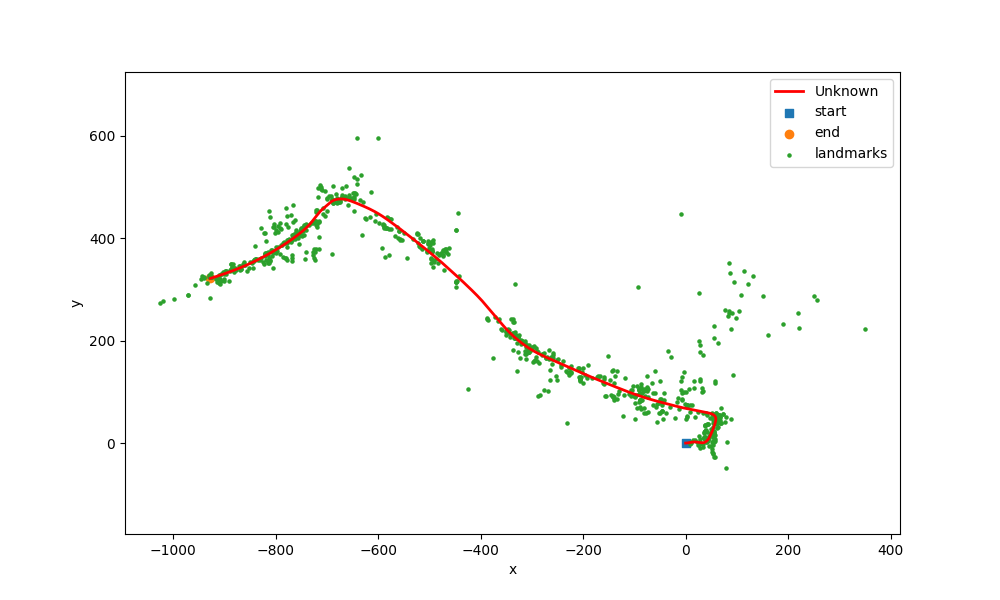
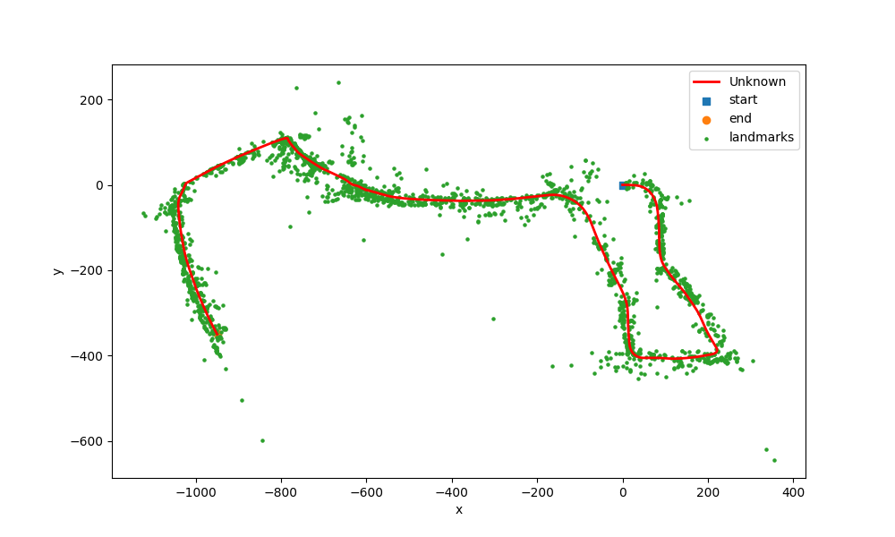

# About
This project implemented a Extended Kalman Filter to solve the Simultaneous Localization and Mapping (SLAM) problem on a robot moving in an initially unknown environment. Specifically we implemented a Visual Inertial Extended Kalman Filter that uses a gaussian distribution to estimate the robot pose and landmark positions at any given time. The map consists of the collection of these landmark feature points.

## Project Structure
<pre>
├── README.md
├── code
│   ├── main.py
│   ├── myutils.py
│   ├── pr3_utils.py
│   └── slam_scratch_code.ipynb
├── data
│   ├── 03.npz
│   ├── 03_video_every10frames.avi
│   ├── 10.npz
│   └── 10_video_every10frames.avi
├── plots
├── problem_statement.pdf
├── report
│   └── report.pdf
└── requirements.txt
</pre>

## Technical Report
* [Saqib Azim. "Visual-Inertial SLAM" March 2023](report/Visual_Inertial_SLAM.pdf)

## To run the Visual-Inertial SLAM code
```
cd code/
```
```
python3 main.py --ds=3 --mapping --featSkip=6 --initPoseCov=0.01 --initLMCov=1.0 --vcov=10 --wcov=1e-2 --distThresh=200
```
- `--ds` (either 3 or 10)
- `--mapping` if specified, then performs visual mapping otherwise directly performs visual-inertial SLAM
- `--initPoseCov`: initial pose covariance diagonal values
- `--initLMCov`: initial LM covariance diagonal values
- `--vcov`: observation model noise covariance values
- For all parts (IMU localization, visual mapping and visual-inertial SLAM) - The main code is `main.py` while most utility functions are implemented in `myutils.py` and in `pr3_utils.py`

## Results

### Independent IMU predict and Landmark Updates 
### Data 03.npz 
<p align ="center">
   
</p>

### Data 10.npz
<p align ="center">
   
</p>